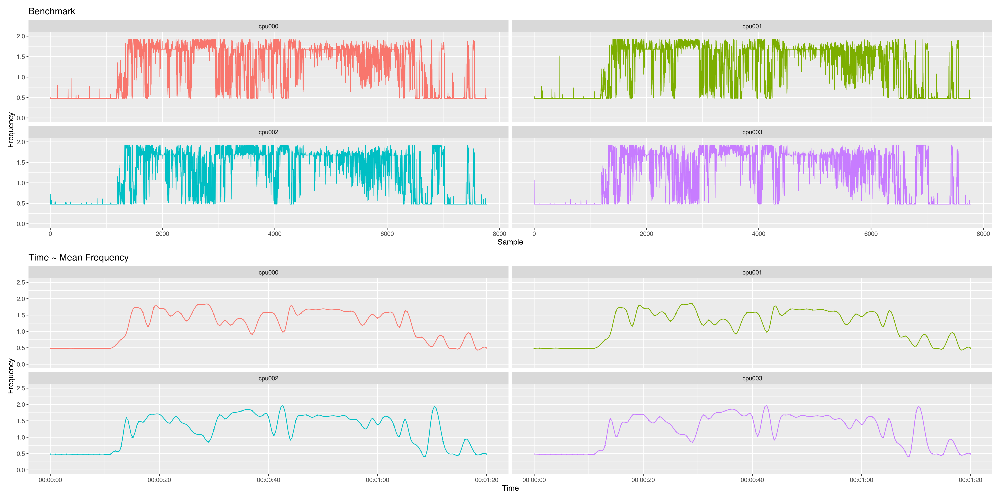

# cpu_freq_logger

Result from the execution of the program

# How To get it up and running

You need two dependencies to be able to install this project: gcc and R, you can 
tell if you have them installed by typing these two commands

    gcc --version
    
    R --version

if any of them yield 
    
    Command not found

you can install them with any package mannager. e.g. :

    sudo apt install gcc
    sudo apt install r-base

Then you might need to install some dependencies in R, mainly most of the tidyverse package.
and patchwork. To do so open up an R environment writing 

    R

in the Terminal. Once it's opened you need to type the following commands into it:

    install.packages("ggplot2")
    install.packages("dplyr")
    install.packages("patchwork")
    install.packages("tibble")
    install.packages("readr")

now you can close the R session writing the quit command

    q()

now write:

    gcc main.c -o freq_logger -O2

and after that you should be able to run the execution script.

    ./run.sh

